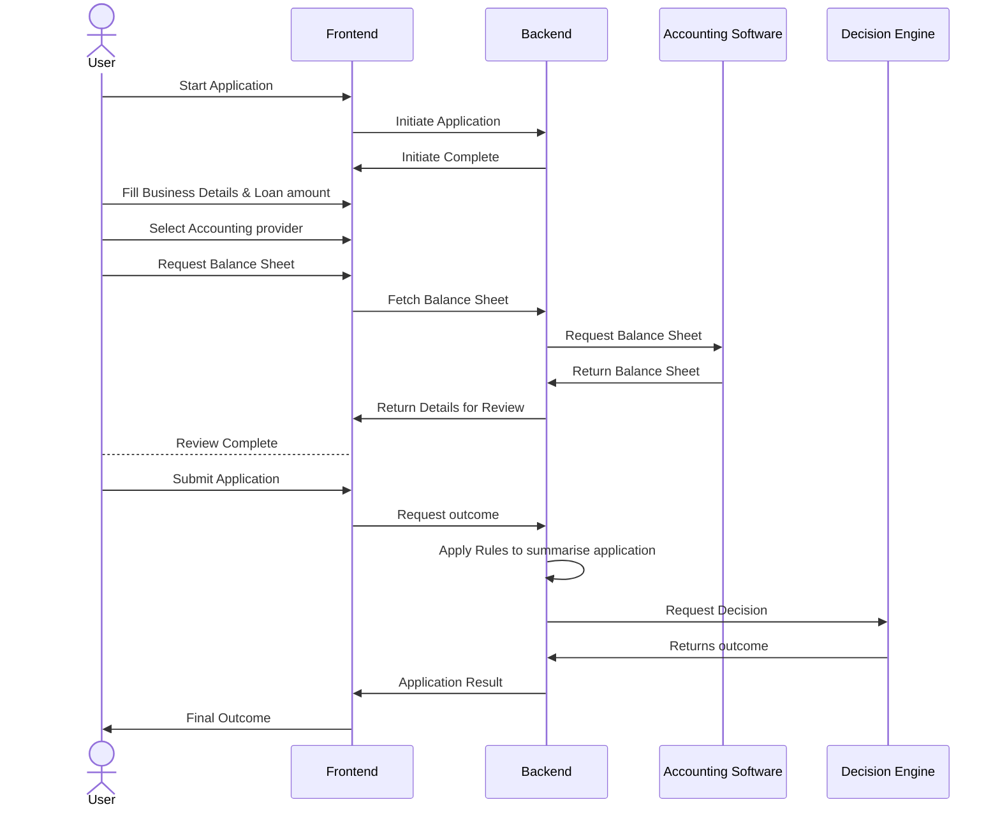

# Running Instructions

Postman collection to use for testing endpoints is included
`CodeKata-Loan-Application-API-Endpoint-Tests.postman_collection.json`

Running with `docker-compose up` will standup the environment, but Postman tests should complete as expected. Cross-container communication was enabled to allow this.

To run successfully without Docker-Compose, execute the following to initialise each component for debugging/testing:
- For frontend. 
  - *With Docker*: From `frontend` folder run
  
    `docker build -t frontend .` 
    
    then run

    `docker run -p 8083:3000 frontend`
  - *Without Docker*: From `frontend` folder run
  
    `pnpm i && pnpm dev`
  - Open web browser to http://localhost:8083
- For backend.
  - *With Docker* From `backend` folder run 
  
    `docker build -t backend .` 
    
    then run

    `docker run -p 8082:80 backend`
  - *Without Docker* From `backend` folder run
  
    `uvicorn main:app --port 8082 --reload`
- For emulating external accounting software endpoints.
  - *With Docker* From `external\account-software` folder run 
  
    `docker build -t account-software .` 
    
    then run

    `docker run -p 8081:80 account-software` 
  - *Without Docker* From `external\account-software` folder run
  
    `uvicorn main:app --port 8081 --reload`
- For emulating decision engine software endpoints. 
  - *With Docker* From `external\decision-engine` folder run 
  
    `docker build -t decision-engine .` 
    
    then run

    `docker run -p 8081:80 decision-engine`
  - *Without Docker* From `external\decision-engine` folder run
  
    `uvicorn main:app --port 8080 --reload`

# Exercise

The goal of the project is to build a simple business loan application system.

The system consists of the following:

- Frontend
- Backend

The backend would integrate with third-party providers such as:

- Decision engine - This is where the final application will be
submitted to present the outcome of the application.
- Accounting software providers will provide a balance sheet for a selected business of the user.

Below is a sequence diagram to help visually understand the flow.



Assumptions:

- You may choose from the following language: Javascript, Typescript, Python, Golang / HTML, CSS.
- For frontend, you could use a framework such as React / Vue, though basic HTML is also acceptable.
- The accounting software and decision engine are already implemented. The backend should provide a simulation of the above.
- The frontend can be very basic.
- The accounting provider option on frontend would include Xero, MYOB and more in future.
- A sample balance sheet received from Accounting provider:

```json

sheet = [
    {
        "year": 2020,
        "month": 12,
        "profitOrLoss": 250000,
        "assetsValue": 1234
    },
    {
        "year": 2020,
        "month": 11,
        "profitOrLoss": 1150,
        "assetsValue": 5789
    },
    {
        "year": 2020,
        "month": 10,
        "profitOrLoss": 2500,
        "assetsValue": 22345
    },
    {
        "year": 2020,
        "month": 9,
        "profitOrLoss": -187000,
        "assetsValue": 223452
    }
]
```

## Rules to be applied before sending to Decision Engine

- If a business has made a profit in the last 12 months. The final value to be sent with a field `"preAssessment": "60"` which means the Loan is favored to be approved 60% of the requested value.
If the average asset value across 12 months is greater than the loan amount then `"preAssessment": "100"`
- Default value to be used `20`

## The Final output to be sent to the decision engine would contain minimum details such as

- Business Details such as:
  - Name
  - Year established
  - Summary of Profit or loss by the year
- preAssessment value as per the rules

## Judging Criteria

- Engineering principles & standards
- System extensibility & Scalability
- Testability
- Brevity and Simplicity

## Bonus Points

- Docker

## FAQ

### What is the time-limit on exercise ?

There is none, ensure you submit your best attempt and as soon as you possibly can.

### How to submit ?

Submit a GitHub / Bitbucket repo for review. No ZIP files!
